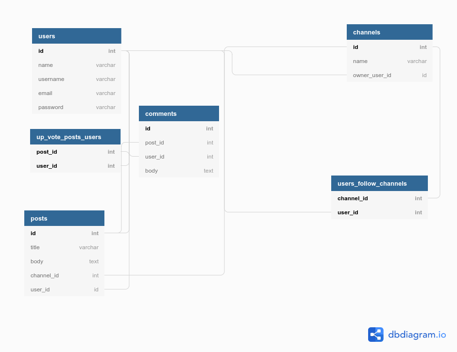

### Clone of reddit

## Features

 Login/Register system

 
Each user can

<ul>
<li>register and edit/delete his own profile
</li>
<li>create any number of channels
</li>
<li>join(follow) any channel
</li>
<li>create a post on any channel
</li>
<li>upvote/downvote any post
</li>
</li>
<li>comment any post
</li>
</ul>

## Database Modeling

view it online: https://dbdiagram.io/d/6062e295ecb54e10c33de73e

// users
// posts
// channels
// user follow channels
// posts-users
// comments

